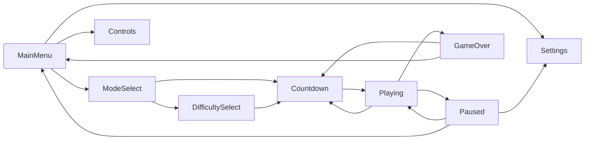

# Architecture

## State Machine

The game uses a `StateId` enum plus a transition table in `volley.config`. Each state class implements `handle_event`, `update(dt)`, and `draw(screen)`.

## Rendering

Gameplay renders to a fixed `960x540` internal surface. The app then scales that surface into the real window with preserved aspect ratio, adding letterbox or pillarbox bars as needed.

## Collision

The ball moves in small sub-steps based on frame distance and checks a swept rectangle from the previous rect to the current rect. This prevents the tutorial-style naive AABB bug where a fast ball jumps completely past a paddle between frames.

## AI

`predict_intercept` projects the ball to the paddle x-plane and folds the y-coordinate through repeated wall bounces. Rookie delays and misjudges, Pro predicts and corrects, and Legendary removes delay while aiming for sharper returns.
